<!-- ═══════════════════════════════════════════════════════════════════ -->
<!--                        FAHAD HAYAT · README                       -->
<!-- ═══════════════════════════════════════════════════════════════════ -->

<!-- ======================= BANNER SVG ======================= -->

<p align="center">

</p>

<br/>

<!-- ======================= BADGES ======================= -->

<p align="center">
  
  &nbsp;
  
  &nbsp;
  
</p>

<br/>


<br/>

<!-- ======================= ABOUT ======================= -->

## `01` &nbsp; About

```yaml
name:    Fahad Hayat
role:    [ Full-Stack Developer, Backend Engineer ]
focus:   [ System Architecture, Real-Time Apps, Distributed Systems, Cybersecurity ]
status:  Building → FusionConnect
learn:   [ Infrastructure Engineering, Backend Optimization ]
```

<br/>

<p align="center">
  
</p>

<br/>


<br/>

<!-- ======================= PROJECTS ======================= -->

## `02` &nbsp; Featured Projects

<br/>

<table width="100%">
  <tr>
    <td width="50%" valign="top">
      <h3><a href="https://github.com/fahadhaya72/FusionConnect">⬡ &nbsp;FusionConnect →</a></h3>
      <p>Real-time full-stack messaging platform with authentication, file uploads, and scalable REST architecture.</p>
      <p>
        <code>Node.js</code> &nbsp;
        <code>React</code> &nbsp;
        <code>MongoDB</code> &nbsp;
        <code>Socket.io</code> &nbsp;
        <code>Redis</code>
      </p>
      <p>
        <sub>✓ Auth System &nbsp;·&nbsp; ✓ Real-Time Messaging</sub><br/>
        <sub>✓ File Uploads &nbsp;·&nbsp; ✓ REST API &nbsp;·&nbsp; ✓ Scalable Workflow</sub>
      </p>
    </td>
    <td width="50%" valign="top">
      <h3><a href="https://github.com/fahadhaya72/E-commerce-Mern-">⬡ &nbsp;MERN E-Commerce →</a></h3>
      <p>Full-featured e-commerce platform with admin dashboard, payment integration, reviews, and responsive UI.</p>
      <p>
        <code>Express</code> &nbsp;
        <code>React</code> &nbsp;
        <code>MongoDB</code> &nbsp;
        <code>Razorpay</code>
      </p>
      <p>
        <sub>✓ Admin Dashboard &nbsp;·&nbsp; ✓ Razorpay Integration</sub><br/>
        <sub>✓ Reviews & Ratings &nbsp;·&nbsp; ✓ Responsive UI</sub>
      </p>
    </td>
  </tr>
</table>

<br/>


<br/>

<!-- ======================= TECH STACK ======================= -->

## `03` &nbsp; Tech Stack

<br/>

<p align="center">
  
</p>

<br/>


<br/>

<!-- ======================= GITHUB STATS ======================= -->

## `04` &nbsp; GitHub Analytics

<br/>

<p align="center">
  
  
</p>

<p align="center">
  
</p>

<p align="center">
  
</p>

<br/>


<br/>

<!-- ======================= LEETCODE ======================= -->

## `05` &nbsp; Competitive Programming

<br/>

<p align="center">
  
</p>

<br/>


<br/>

<!-- ======================= SNAKE ======================= -->

## `06` &nbsp; Contribution Trail

<br/>

<p align="center">
  
</p>

<br/>


<br/>

<!-- ======================= CONNECT ======================= -->

## `07` &nbsp; Connect

<br/>

<p align="center">
  <a href="https://github.com/fahadhaya72">
    
  </a>
  &nbsp;&nbsp;
  <a href="https://linkedin.com">
    
  </a>
  &nbsp;&nbsp;
  <a href="mailto:yourmail@gmail.com">
    
  </a>
</p>

<br/>

<!-- ======================= FOOTER ======================= -->


<br/>

<p align="center">
  <sub><code>fahadhaya72 · built with precision · © 2025</code></sub>
</p>
