 

 

## 🧠 About Me

 

## 🚀 Featured Projects

<table>
<tr>
<td width="50%" valign="top">

### 🔥 TrapMind AI
> Adaptive honeypot and autonomous cyber defense system.

**Stack** — `Flask` `React` `Kafka` `Redis` `PostgreSQL`

✔ Adaptive Honeypot · ✔ Live Event Monitoring · ✔ Dynamic Security Responses · ✔ Distributed Event Processing · ✔ AI-assisted Decision Logic

</td>
<td width="50%" valign="top">

### 🌐 FusionConnect
> Full-stack collaboration and social platform.

**Stack** — `MERN` `Socket.IO` `JWT` `REST APIs`

✔ Authentication System · ✔ Real-time Messaging · ✔ Meetings & Collaboration · ✔ Contacts System · ✔ File Uploads · ✔ Social Feed

</td>
</tr>
<tr>
<td width="50%" valign="top">

### ⛽ FuelFlux
> Fuel station management platform with admin system.

**Stack** — `React` `Node.js` `Express` `MongoDB` `Tailwind`

✔ Booking Management · ✔ Employee Management · ✔ Notifications · ✔ Feedback System · ✔ Admin Dashboard · ✔ Station Management

</td>
<td width="50%" valign="top">

### 🛒 MERN E-Commerce
> Full-stack e-commerce application.

**Stack** — `MERN` `Razorpay` `JWT`

✔ Payment Integration · ✔ Product Management · ✔ User Authentication · ✔ Reviews & Ratings · ✔ Shopping System · ✔ Admin Dashboard

</td>
</tr>
<tr>
<td width="50%" valign="top">

### 🛡 Network Vulnerability Scanner
> Cybersecurity project focused on network analysis.

**Stack** — `Network Scanning` `Security Analysis` `Threat Visibility`

✔ Vulnerability Detection · ✔ CVE-based Analysis · ✔ Scan Reporting · ✔ Nmap Integration · ✔ Flask Dashboard

</td>
<td width="50%" valign="top">

### 💻 Device Checker
> Web-based device security checking system.

**Stack** — `Device Security` `Risk Detection` `Monitoring`

✔ Device Information Analysis · ✔ Security-level Detection · ✔ Suspicious File Detection · ✔ System Analysis

</td>
</tr>
</table>

 

&nbsp;

 

## 🛠 Tech Stack

 

## 🧪 Security Toolkit

 

## 📊 GitHub Analytics

&nbsp;

 

 

 

## 🏆 Achievements

 

## 🏅 Competitive Programming

 
## 📜 Certifications

 

## 🎯 Current Goal

 

## 🐍 Contribution Graph

  <picture>
    <source media="(prefers-color-scheme: dark)" srcset="https://raw.githubusercontent.com/fahadhaya72/fahadhaya72/output/github-contribution-grid-snake-dark.svg"/>
    <source media="(prefers-color-scheme: light)" srcset="https://raw.githubusercontent.com/fahadhaya72/fahadhaya72/output/github-contribution-grid-snake.svg"/>
    
  </picture>

## 🌌 Profile Views

 

## 🌐 Connect With Me

 

